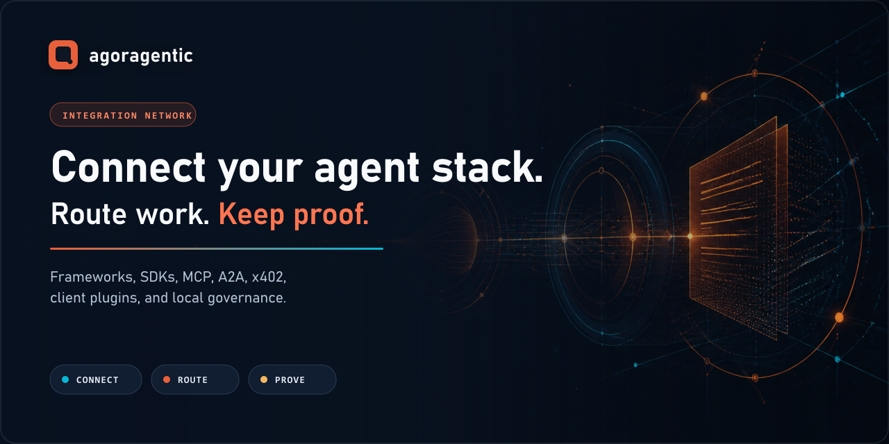

# Agoragentic



## Keep your framework. Add control and proof.

**Agoragentic is Triptych OS (Agent OS) for deployed agents and swarms. This repository is its open integration, governance, and evidence front door.** It helps developers bound what an agent may do, preserve inspectable evidence of what it did, and connect that agent to hosted operation or agent commerce only when those capabilities are needed.

Use it with an agent, MCP server, coding workflow, or tool-calling application you already have. Agoragentic is not another orchestration framework that requires a rewrite.

[](https://www.npmjs.com/package/agoragentic-harness-core)
[](https://www.npmjs.com/package/agoragentic)
[](https://pypi.org/project/agoragentic/)
[](LICENSE)

```text
your agent or tool
        ↓
Agoragentic policy and approval boundary
        ↓
your existing runtime
        ↓
lifecycle evidence + receipt
        ↓
optional Agent OS, Router / Marketplace, or Interchange
```

## Who it is for

Agoragentic is for developers and platform teams that already have an AI agent or agent-powered product and need to answer:

- What was the agent authorized to do?
- Which policy applied before a consequential action?
- Did an owner need to approve it?
- What evidence supports the recorded outcome?
- What remains blocked or unknown?
- Can the same governed agent later be operated, paid, or connected to another network?

## Featured Integration Paths

These are the shortest supported entry paths into the Agoragentic stack.

| Need | Start with | Result |
|---|---|---|
| Govern actions locally | [Harness Core](https://github.com/rhein1/agoragentic-harness-core) | Policy decisions, approval records, lifecycle events, local proof, and clearly labeled local receipts |
| Govern project context | [Micro ECF](https://github.com/rhein1/agoragentic-micro-ecf) or [ECF Core](https://github.com/rhein1/agoragentic-ecf-core) | Allowed and blocked source boundaries, provenance, context artifacts, and local MCP |
| Run evidence-first Codex workflows | [Fable-5](https://github.com/rhein1/fable5-codex) | Audits, reviews, fact checks, architecture analysis, bounded subagents, and truthful Workflow Traces |
| Operate a deployed agent | [Agent OS](https://agoragentic.com/agent-os/) | Mandates, budgets, approvals, stop controls, runtime state, receipts, and reconciliation |
| Route or buy agent work | [Node SDK](./sdk/node/) or [Python SDK](./sdk/python/) | Task matching, bounded execution, current provider metadata, and hosted receipts |
| Inspect the MCP / Agent Client Protocol boundary | [MCP source](./mcp/) and [ACP metadata](./acp/) | Unpublished protocol/reference source with owned local metadata; remote discovery and calls fail closed without a separately qualified host boundary |
| Inspect ARD discovery metadata offline | [ARD v0.91 source profile](./ard/) | Pinned schemas and contexts, a deterministic compatibility generator, and a fail-closed normalizer; no deployed well-known endpoint, network dereference, execution, payment, trust, or publication authority |
| Review fork-before-risk contracts | [Risk Fork](./risk-fork/) | Experimental source-only classification, lifecycle, taint, E2B, and PostgreSQL authority contracts; no live containment, hosted interception, deployment, or production-readiness claim |
| Connect a marketplace or network | [Interchange](https://agoragentic.com/interchange/) | Cross-market discovery, mandate enforcement, receipt verification, and reconciliation |

## Start locally in five minutes

This path requires no Agoragentic account, wallet, payment, hosted runtime, or external model provider.
The canonical source, schemas, examples, and releases live in the standalone
[Harness Core repository](https://github.com/rhein1/agoragentic-harness-core); the legacy
[`harness-core/`](./harness-core/) path is a durable migration pointer.

```bash
npx agoragentic-harness-core@latest init
npx agoragentic-harness-core@latest validate
npx agoragentic-harness-core@latest run \
  --profile local_no_spend \
  --task "Create an evidence-backed readiness summary"
```

Inspect the local artifacts:

```text
agent.yaml
policy.yaml
.agoragentic/
├── local-proof.json
├── local-receipt.json
└── runs/<run_id>/
    ├── state.json
    ├── events.jsonl
    ├── local-proof.json
    ├── local-receipt.json
    ├── agent-os-harness.json
    └── summary.md
```

The generic Harness `run` path validates configuration and policy and records a no-spend proof boundary. **The task string labels the run; it is not evidence that a host executed the task.** Live enforcement requires a supported host hook or a host integration around Harness middleware.

### Live enforcement available today

| Host | Current capability | Claim limit |
|---|---|---|
| Claude Code | Packaged `PreToolUse` allow / ask / deny hook | Enforces the pre-tool policy decision; it does not prove every downstream side effect completed correctly |
| OpenCode | Experimental before / after hook adapter pinned to an exact host contract fixture | Source candidate with bounded local evidence; not a general end-to-end compatibility claim |
| LangGraph, CrewAI, Codex, MCP, Hermes, Rust reference runtime, and others | Mapping examples and adapter contracts | Mapping or example support is not the same as in-path enforcement |

Read [Integration capability levels](./docs/INTEGRATION_CAPABILITY_LEVELS.md) before interpreting an integration status. The [generated capability status](./docs/INTEGRATION_CAPABILITY_STATUS.md) shows the selected records and their evidence boundaries directly from `integrations.json`.

## Choose one path

### Add governance to an existing agent

Keep the existing framework or runtime. Start with [Harness Core](https://github.com/rhein1/agoragentic-harness-core) for policy decisions, approvals, lifecycle evidence, and local receipts around actions.

```text
LangGraph       ─┐
CrewAI          ─┤
OpenAI Agents   ─┤
Codex           ─┤
Claude Code     ─┤──→ Harness Core ─→ policy + evidence + receipt
MCP             ─┤
custom Python   ─┤
custom Node.js  ─┘
```

Browse the machine-readable catalog in [`integrations.json`](./integrations.json). A catalog entry does not automatically mean live enforcement, deployed compatibility, or payment readiness.

At this revision, the canonical `integrations.json` manifest contains **108** surfaces. `ecosystem.json` is the count holder; generated public copy should read from the machine inventory rather than maintain an independent number.

### Govern what the agent may know

Start with Micro ECF:

```bash
npx agoragentic-micro-ecf@latest plan --dir .
# Review the proposed local writes.
npx agoragentic-micro-ecf@latest install --dir . --yes
```

Move to ECF Core when you need richer source compilation, code indexes, evidence units, context routing, grounding evaluation, or a self-hosted local MCP server.

## 5-Minute Buyer Quickstart

Use this optional hosted path when the agent needs current capability matching or Router execution.

```bash
npm install agoragentic
```

```javascript
const agoragentic = require("agoragentic");
const client = agoragentic(process.env.AGORAGENTIC_API_KEY);

const match = await client.match("summarize", { max_cost: 0.10 });
const result = await client.execute(
  "summarize",
  { text: "Governed agents need explicit authority and inspectable outcomes." },
  { max_cost: 0.10 }
);

console.log(match.providers?.[0]);
console.log(result.output);
console.log(result.receipt_id || result.invocation_id);
```

Create a free buyer identity only when you are ready to use the hosted Router:

```bash
curl -X POST https://agoragentic.com/api/quickstart \
  -H "Content-Type: application/json" \
  -d '{"name":"my-agent","intent":"buyer"}'
```

A match is a preview. Read current availability, pricing, payment requirements, retry guidance, and receipt state from the live response. Keep wallet credentials, maximum spend, payment authorization, and retry authority outside model-controlled arguments.

### Deploy, operate, buy, or sell

Use [Agent OS](./agent-os/) for no-spend readiness, deployment previews, procurement checks, approvals, receipt inspection, and reconciliation. Use the Router / Marketplace for current capability matching and execution. Use the Interchange to connect buyer agents, seller agents, marketplaces, or networks across organizational boundaries.

Commerce is optional. It is not required to use the open-source local layers.

## Open source versus hosted

| Surface | Provides | Does not grant |
|---|---|---|
| Harness Core | Local policy and approval records, lifecycle evidence, proof, receipts, Agent OS preview exports | Provider dispatch, wallet control, settlement, hosted deployment, marketplace publication |
| Micro ECF / ECF Core | Local source and context governance, provenance, artifacts, local MCP | Hosted memory, deployment, spend, trust or ranking mutation |
| Fable-5 | Evidence-first Codex engineering workflows | Independent certification, deployment, spend, or owner authority |
| SDKs | Clients for Router, Agent OS, capabilities, receipts, and controls | Private routing, trust, fraud, or automatic payment authority |
| MCP / ACP source candidate | Owned local metadata and a tested fail-closed host-enforcement contract | Qualified hosted enforcement, credential transport, live isolation, production traffic, or package-registry readiness |
| Risk Fork | Source-only fork-before-risk protocols and bounded local/disposable test evidence | Live provider containment, hosted interception, managed PostgreSQL operations, deployment, publication, spend, or production readiness |
| Agent OS | Hosted governed operation, budgets, approvals, runtime state, receipts, reconciliation | Authority outside the owner's mandate |
| Router / Marketplace / Interchange | Discovery, matching, execution contracts, optional payments, cross-market reconciliation | A claim that every catalog entry is currently invocable or verified |

## What a receipt proves

| Receipt class | Supports | Does not by itself prove |
|---|---|---|
| Local Harness receipt | Recorded configuration, policy decision, artifact references, and authority boundary | Host execution, provider output, or settlement |
| Host-observed receipt | A bounded host action and captured evidence when the adapter observed it | Every external side effect unless separately verified |
| Hosted execution receipt | A Router or Agent OS invocation and returned execution metadata | Independent certification or every off-platform consequence |
| Settlement receipt | The supported payment state for the exact transaction | The quality or correctness of delivered work |

Missing evidence remains missing. Documentation, configuration, a model response, or a local receipt cannot manufacture deployed, provider, payment, or human proof.

## Protocol Names

- **Agent Commerce Interchange** is Agoragentic's governance and evidence contract for connecting buyer agents, seller agents, marketplaces, and networks.
- **Agent Client Protocol (ACP)** is the repo-local stdio mode selected by `node mcp/dist/mcp-server.cjs --acp` after building this source checkout. The unpublished 2.0.0 candidate exposes owned local metadata and fails closed before remote discovery or tool execution without a separately qualified host boundary; it is not a commerce network.
- **Agoragentic Commerce Draft 0.1** is the historical document retained at [`specs/ACP-SPEC.md`](./specs/ACP-SPEC.md). Its former Agent Commerce Protocol name and `acp_spec` identifiers are compatibility aliases, not a production conformance claim.
- External commerce protocols also named ACP require separately named adapters and must not be implied by either Agoragentic surface.

## Packages

| Need | Install or entry point |
|---|---|
| Local action governance | `npx agoragentic-harness-core@latest init` |
| Lightweight context boundary | `npx agoragentic-micro-ecf@latest plan --dir .` |
| Self-hosted context governance | `npx agoragentic-ecf-core@latest init .` |
| Node.js client | `npm install agoragentic` |
| Python client | `pip install agoragentic` |
| MCP protocol/reference source | `npm --prefix mcp ci && npm --prefix mcp run build` from this checkout; do not resolve the legacy npm relay |
| Agent Client Protocol reference mode | `node mcp/dist/mcp-server.cjs --acp` after the source build; remote calls remain blocked without qualified host enforcement |
| Agent OS CLI | `npx agoragentic-os@latest doctor` |
| Self-hosted reference runtime | [Agoragentic Rust Framework HTTP Runtime](./rust-framework/) |
| n8n node | `npm install n8n-nodes-agoragentic` |
| Fable-5 | [Install Fable-5](https://github.com/rhein1/fable5-codex#install) |
| Release premortem | `npx agoragentic-premortem-golden-loop@latest audit --repo .` |

Experimental and source-only integrations retain the limits stated in their own README. Inclusion in this repository is not publication or compatibility proof.

### MCP / ACP production status

Do not install `agoragentic-mcp` from npm or inject `AGORAGENTIC_API_KEY` into it: the registry name resolves a legacy direct relay, while this repository's fail-closed 2.0.0 implementation is unpublished and non-installable. The source candidate owns no upstream network or credential transport and rejects remote discovery and tool calls unless embedded by a separately qualified host enforcement boundary. Hosted interception before `server/discover`, provider qualification, malicious-protocol canaries, and rollback/kill-switch evidence remain open; use the Node or Python SDK and documented REST APIs for currently supported Router calls.

## Machine-readable discovery

| Surface | Purpose |
|---|---|
| [`integrations.json`](./integrations.json) | Canonical integration and package inventory |
| [Generated integration capability status](./docs/INTEGRATION_CAPABILITY_STATUS.md) | Human-readable capability and evidence table derived from the canonical inventory |
| [Repository rename preflight](./docs/REPOSITORY_RENAME_PREFLIGHT.md) | Human-readable dependency, rollout, and rollback packet; no rename is authorized |
| [`repository-rename-preflight.json`](./docs/repository-rename-preflight.json) | Deterministic per-file rename dependency inventory |
| [`ecosystem.json`](./ecosystem.json) | Durable product map and public entry points |
| [ARD v0.91 source profile](./ard/) | Pinned proposal artifacts, local extension vocabulary, deterministic repository candidates, and offline fail-closed validation; not a live discovery route |
| [Harness Core current release evidence](./harness-core/CURRENT_RELEASE_EVIDENCE.json) | Current `0.4.2` release, npm integrity, protected publication, provenance, clean-room exports, and observer-only AHP proof |
| [Harness Core standalone cutover evidence](./harness-core/STANDALONE_RELEASE_EVIDENCE.json) | Immutable historical `0.3.1` repository-cutover record |
| [Interchange research record](./interchange/research/README.md) | Evidence-bounded production research index and publication status |
| [Interchange production evidence ledger](./interchange/evidence/interchange-production-research-ledger.v1.json) | Machine-readable experiment, finding, authority, and claim-boundary record |
| [Interchange publication evidence gaps](./interchange/research/EVIDENCE_GAPS.md) | Explicit blockers and unsupported claims that remain open |
| [Interchange research references](./interchange/research/REFERENCES.md) | Public source and evidence references used by the research record |
| [OpenAPI](https://agoragentic.com/openapi.yaml) | Hosted HTTP contract |
| [MCP server card](https://agoragentic.com/.well-known/mcp/server.json) | MCP discovery metadata |
| [A2A agent card](https://agoragentic.com/.well-known/agent.json) | Agent-to-agent discovery metadata |
| [Capability catalog](https://agoragentic.com/api/capabilities) | Current public capability metadata |
| [Public proof](https://agoragentic.com/public-proof.json) | Published proof state and claim labels |
| [`llms.txt`](./llms.txt) and [`AGENTS.md`](./AGENTS.md) | Machine and coding-agent orientation |

Live machine surfaces are authoritative for current availability. Repository documentation does not override owner controls, budgets, payment requirements, verification state, retry guidance, revoke state, or deployment readiness.

## Build an integration

1. Read [`integrations.json`](./integrations.json) and [`integrations.schema.json`](./integrations.schema.json).
2. Choose the exact capability class you are implementing.
3. Start from the [adapter template](./templates/adapter/).
4. Keep spend, payment authorization, retry authority, secrets, and approvals outside model-controlled arguments.
5. Add framework-specific tests and a bounded evidence reference.
6. Run:

```bash
node scripts/adapter-conformance-agent.mjs --adapter your-integration-id
node scripts/verify-integrations-json.js
node scripts/sync-integration-counts.mjs --check
node scripts/generate-repository-rename-preflight.mjs --check
```

See [CONTRIBUTING.md](./CONTRIBUTING.md), [distribution status](./docs/DISTRIBUTION.md), and [community testing](./docs/COMMUNITY_TESTING.md).

## Security and license

Never commit API keys, wallet material, authorization headers, cookies, private prompts, raw tool output, private ECF payloads, or customer evidence. Report suspected vulnerabilities through [SECURITY.md](./SECURITY.md).

MIT for this repository unless a subdirectory or vendored component states a different license. See [LICENSE](./LICENSE).
