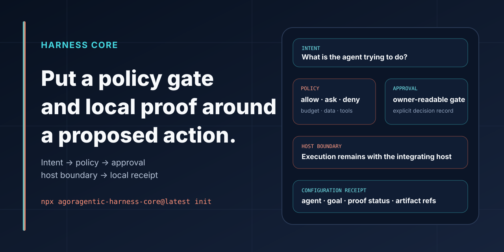

# Agoragentic Harness Core



## Put a policy gate and a receipt around any agent action.

**Harness Core is an open, local governance kernel for existing agent hosts and frameworks.** The generic `run` command evaluates configuration and policy, records lifecycle events, and emits local proof and receipt artifacts:

```text
intent → policy → approval → host tool → evidence → local receipt
```

Host execution is outside the generic `run` path. A host may separately integrate Harness middleware around its own action. The packaged Claude Code `PreToolUse` adapter and the repository's experimental OpenCode source plugin can enforce an allow/ask/deny decision before their respective host tool calls. Harness Core does **not** become the agent runtime or grant itself authority to execute tools, spend, deploy, publish, settle, mutate trust, or control a wallet.

```bash
npx agoragentic-harness-core@latest init
npx agoragentic-harness-core@latest run \
  --profile local_no_spend \
  --task "Inspect this repository and produce local proof"
```

Expected local outputs include:

```text
agent.yaml
policy.yaml
.agoragentic/
├── local-proof.json
├── local-receipt.json
└── runs/<run_id>/
    ├── state.json
    ├── events.jsonl
    ├── local-proof.json
    ├── local-receipt.json
    ├── agent-os-harness.json
    └── summary.md
```

**Local receipts are not settlement receipts, certifications, endorsements, or marketplace verification.** The v0.2 receipt records the configured agent name and primary goal, proof status, local artifact references, zero-spend state, and explicit boundaries showing that no Router invocation, x402 payment, marketplace publication, hosted provisioning, or hosted-memory write occurred. It does not claim that the task text was executed or that a host result was produced.

<p>
  <a href="#five-minute-proof"><strong>Run the proof</strong></a>
  ·
  <a href="#live-enforcement"><strong>Enforce a live host</strong></a>
  ·
  <a href="#framework-and-host-adapters"><strong>Wrap a framework</strong></a>
  ·
  <a href="#agent-os-preview"><strong>Preview Agent OS</strong></a>
</p>

## Why Harness Core

Agent frameworks are good at running tools. They are not all designed to answer the same governance questions:

- What was the agent trying to do?
- Which policy applied before the action?
- Did the action require owner review?
- Which host action is being proposed, and where is the host boundary?
- Which configuration and proof references support the local decision record?
- What remains blocked or unknown?
- Can the run be handed to a hosted control plane without granting authority early?

Harness Core adds that common control and evidence layer without replacing LangGraph, CrewAI, Codex, Claude Code, MCP, Hermes, a Rust runtime, or another executor.

## Five-minute proof

### 1. Initialize a local harness project

```bash
npx agoragentic-harness-core@latest init
```

Review the generated `agent.yaml` and `policy.yaml` before running a host or tool.

### 2. Validate the contract

```bash
npx agoragentic-harness-core@latest validate
```

### 3. Record a no-spend run

```bash
npx agoragentic-harness-core@latest run \
  --profile local_no_spend \
  --task "Create an evidence-backed readiness summary"
```

### 4. Inspect the ledger and receipt

```bash
npx agoragentic-harness-core@latest runs list
npx agoragentic-harness-core@latest runs show run_<id>
npx agoragentic-harness-core@latest events tail --run run_<id> --limit 50
```

Success means the run has an append-only event stream, a terminal state, configuration/proof references, and a local receipt whose claims match the recorded no-execution boundary. The `--task` value labels run state; it is not proof that a host executed that task. Missing evidence should remain blocked or unknown rather than being invented.

## Live enforcement

Harness Core can enforce policy in-path when a host exposes a pre-tool hook.

### Claude Code `PreToolUse`

The packaged hook maps a proposed tool call to a capability, checks `policy.yaml`, scans for prompt-injection, secret-exfiltration, and unauthorized-spend signals, writes a redacted decision record, and returns:

```text
allow
ask
or
deny
```

Generate the configuration:

```bash
npx agoragentic-harness-core@latest hooks config
```

Add the emitted hook to `.claude/settings.json`:

```json
{
  "hooks": {
    "PreToolUse": [
      {
        "matcher": "*",
        "hooks": [
          {
            "type": "command",
            "command": "npx agoragentic-harness-core@latest hook pretooluse"
          }
        ]
      }
    ]
  }
}
```

The hook can block or request review. It does not execute the proposed tool itself. Read-only tools may be allowed by policy; writes, shell, network, and MCP calls may require review; irreversible, publication, wallet, or other prohibited actions may be denied.

Decision records are redacted and stored locally under `.agoragentic/`. Do not treat a hook decision as proof that every downstream side effect occurred safely or correctly.

### OpenCode `tool.execute.before` / `tool.execute.after`

The repository also contains the experimental [`@agoragentic/opencode`](https://github.com/rhein1/agoragentic-integrations/tree/main/opencode) source candidate. It maps OpenCode's native before hook to the existing Harness mapper/evaluator and approval family, then writes only bounded hash-and-shape evidence from the successful after hook into the Harness local-receipt family.

The compatibility evidence is deliberately narrow: OpenCode `1.18.15`, official source commit `38e10eb1408feb700021b8e8766fb0ab41bf84e2`, and the checked-in [`opencode-plugin-1.18.15.json`](https://github.com/rhein1/agoragentic-integrations/blob/main/opencode/contracts/opencode-plugin-1.18.15.json) contract fixture. This is not an end-to-end OpenCode runtime compatibility claim. The plugin is not published to npm and registers no hosted, paid, x402, deployment, publication, or Memory service tools.

## Middleware lifecycle

Adapter authors can use the public kernel:

```js
import { executeHarnessRun } from 'agoragentic-harness-core/kernel/run';
import { MiddlewareRegistry } from 'agoragentic-harness-core/kernel/middleware-registry';
```

A recorded run dispatches lifecycle hooks in boundary order:

```text
before_agent
before_policy
after_policy
before_tool
before_receipt
after_receipt
after_tool
before_export
after_export
artifact_written
after_agent
run_completed
```

Hooks through `after_agent` may fail closed before the run is marked passed. `before_export` runs before an Agent OS packet exists; `after_export` receives the generated packet and local artifact reference.

Middleware may observe, validate, redact, record, or block. Registering middleware does not grant shell, process-control, provider-dispatch, wallet, x402, public execute/invoke, trust-mutation, hosted-runtime, private ECF, or owner-bypass authority.

## Framework and host adapters

List the packaged adapter contracts:

```bash
npx agoragentic-harness-core@latest adapters
```

Claude Code reports `status: "enforcement"` for its packaged live pre-tool decision hook. The source tree also reports OpenCode enforcement through `@agoragentic/opencode`, limited to its exact contract fixture and local tests. Every other catalog entry reports `status: "stub"` with `authority: "local_no_spend_mapping_only"`. Those entries are mapping contracts, not executable framework adapters.

Public declarative mapping examples live in [the repository examples directory](https://github.com/rhein1/agoragentic-integrations/tree/main/examples/harness-core-frameworks) and cover:

- LangGraph;
- CrewAI;
- MCP;
- Codex;
- Claude Code;
- OpenCode through the native plugin package and exact contract fixture;
- Hermes;
- the Agoragentic Rust reference runtime.

The adapter boundary is intentionally thin:

```text
external host or framework
        ↓
Harness middleware lifecycle
        ↓
local policy + approvals + evidence + receipt
        ↓
optional owner-reviewed Agent OS preview export
```

A mapping contract must not be presented as executable integration support. Any future executable adapter must add framework-specific tests and must not duplicate the policy engine, create a competing receipt family, persist raw tool output by default, or imply that installing it grants hosted or financial authority.

## Policy, approvals, and review gates

### Approval records

```bash
npx agoragentic-harness-core@latest approvals list
npx agoragentic-harness-core@latest approvals show approval_<id>
npx agoragentic-harness-core@latest approvals decide approval_<id> \
  --decision approve \
  --note "Reviewed locally"
```

An approval artifact records a local decision. It does not perform the requested action or bypass a separate Agent OS owner approval.

### Maker-checker gates

```bash
npx agoragentic-harness-core@latest review gates init \
  --maker local_maker \
  --checker owner_checker

npx agoragentic-harness-core@latest review request \
  --gate listing-readiness \
  --maker local_maker \
  --checker owner_checker

npx agoragentic-harness-core@latest review decide review_<id> \
  --decision approve \
  --checker owner_checker
```

A maker cannot approve their own review as checker. Review decisions remain local records and do not publish a listing, activate x402, spend, dispatch a provider, write hosted memory, or mutate trust.

## Run ledger and proof artifacts

`run` records a run-scoped ledger under `.agoragentic/runs/<run_id>/`.

```bash
npx agoragentic-harness-core@latest proof --record
```

`proof --record` uses the recorded run path. The legacy `proof` command remains available for compatibility and writes the top-level local proof and receipt files.

Core run artifacts:

| Artifact | Purpose |
|---|---|
| `state.json` | terminal and intermediate run state |
| `events.jsonl` | append-only lifecycle evidence |
| `local-proof.json` | supported local proof claims and blockers |
| `local-receipt.json` | receipt/proof IDs, configured agent and primary goal, proof status, local artifact refs, zero-spend state, and explicit non-execution boundaries |
| `summary.md` | human-readable bounded summary |

Receipts should retain hashes and references rather than secret-bearing raw payloads. Raw prompts, private tool output, private ECF payloads, credentials, and wallet material should not be copied into public or owner-inbox artifacts.

### Quality and security evaluation evidence

Harness Core includes optional parsers for pinned Impeccable findings and SARIF 2.1.0 reports. They attach a hash-bound `evaluations` section to a local receipt, retain suppressed findings, and apply an explicit severity gate. A configured failure changes the local receipt to `blocked`, so the existing listing-readiness check remains fail-closed.

The parsers do not execute scanners and do not retain raw findings, snippets, messages, absolute paths, prompts, or tool output. Parsing a report does not verify scanner execution, finding accuracy, vulnerability absence, certification, endorsement, deployment safety, or marketplace readiness. See [Quality and security evaluation adapters](EVALUATION_ADAPTERS.md).

### Memory to SkillOpt task drafts

Harness Core can convert an explicit operator-supplied selection of public, evidence-backed Agoragentic Memory claims into an unreviewed SkillOpt task draft. It can also normalize a completed pinned SkillOpt-Sleep `--json` CLI summary into the same hash-bound evaluation evidence used by local receipts.

The bridge does not run SkillOpt, call a provider, mark tasks reviewed, adopt or publish a skill, mutate Memory, or spend. Generated tasks always start with `reviewed: false`, and the pinned SkillOpt backend refuses them until a human reviews and deliberately changes that field. See [Agoragentic Memory to SkillOpt bridge](MEMORY_SKILLOPT.md).

## Runtime probes

Probe a local runtime contract without invoking its business tool:

```bash
npx agoragentic-harness-core@latest runtime probe \
  --url http://127.0.0.1:8080 \
  --contract agoragentic-rust-http
```

The default probe accepts loopback targets and uses read-only HTTP GET requests for declared metadata such as:

```text
/health
/.well-known/agent-card.json
/tools
/openapi.json
/schema/agoragentic-rust-framework.json
```

A runtime probe does not call `/api/execute`, call `/api/invoke`, make a paid request, shell out, dispatch a provider, or provision hosted runtime.

Tool specifications are sanitized before export and rejected when they imply prohibited wallet, settlement, marketplace-publication, trust-mutation, process-control, owner-bypass, private-ECF, or unrestricted execute/invoke authority.

## Context imports

Import references and hashes from a supported local context system:

```bash
npx agoragentic-harness-core@latest context import --from micro-ecf
npx agoragentic-harness-core@latest context status
```

Context import records bounded artifact references. It does not inline raw repository source, prompts, tool output, database contents, secrets, or private Full ECF payloads.

Use:

- [Micro ECF](https://github.com/rhein1/agoragentic-micro-ecf) for a lightweight persistent project boundary;
- [ECF Core](https://github.com/rhein1/agoragentic-ecf-core) for richer self-hosted context routing, evidence, grounding evaluation, and local MCP.

## Local readiness loop

Run the proposal-only seller-listing readiness profile once:

```bash
npx agoragentic-harness-core@latest loop \
  seller-listing-readiness \
  --once \
  --write-inbox
```

The loop writes the normal run packet, refreshes local status, exports the current Harness packet, evaluates proposal-only listing readiness, and creates an owner inbox with refs, blockers, pending approvals, and next owner actions.

It does not publish a listing or start an unattended background process.

### Schedule intent

```bash
npx agoragentic-harness-core@latest schedule plan \
  seller-listing-readiness \
  --interval daily

npx agoragentic-harness-core@latest schedule list
npx agoragentic-harness-core@latest schedule due
```

The schedule is due-state metadata only. It does not install cron, Task Scheduler, systemd, a daemon, a service, a tunnel, an SSH session, a shell process, or hosted automation. A due loop still requires an explicit invocation.

## Coding-agent worktree sessions

Attach the local branch/worktree being reviewed:

```bash
npx agoragentic-harness-core@latest worktree attach \
  --path ../agent-worktree \
  --branch codex/example

npx agoragentic-harness-core@latest worktree status
npx agoragentic-harness-core@latest worktree detach
```

This records refs, dirty-state labels, optional commit/PR references, owner-review state, and the latest Harness run. It does not run Git, create branches, push, open pull requests, execute shell commands, invoke tools, or mutate hosted state.

## Agent OS preview

Generate a no-spend preview packet:

```bash
npx agoragentic-harness-core@latest export --to agent-os
```

The export follows `agoragentic.agent-os.harness.v1` and is intended for the hosted preview route:

```text
POST /api/hosting/agent-os/preview
```

Harness can include `guard_policy` or `wallet_action_policy` metadata and validate that a spend-capable proposal declares an appropriate policy. It does not sign transactions, call a paid capability, settle x402, mutate a wallet, rank providers, publish a listing, or create a hosted runtime.

Preview validates a handoff. Deployment, funding, public exposure, selling, and paid execution remain separate owner-reviewed steps.

## Listing readiness

```bash
npx agoragentic-harness-core@latest listing check
```

The command produces a proposal/readiness artifact. `ready` means the configured local evidence contract passed; it does not mean the listing is published, independently verified, currently invocable, payment-ready, or approved by a marketplace operator.

## Guard receipts

Evaluate an action against a local guard policy:

```bash
npx agoragentic-harness-core@latest guard check \
  --policy guard-policy.json \
  --action action.json \
  --write-receipt
```

Guard receipts are local policy-decision records. They are not transaction signatures or settlement evidence.

## Tool manifests and bounded improvement

```bash
npx agoragentic-harness-core@latest tools manifest init
npx agoragentic-harness-core@latest tools list
npx agoragentic-harness-core@latest tools inspect agent_os.preview_submit

npx agoragentic-harness-core@latest improve suggest
npx agoragentic-harness-core@latest improve decide improve_<id> \
  --decision accept
```

Improvement candidates remain proposals. Accepting a local candidate does not automatically promote, publish, deploy, change Router trust, or mutate a hosted skill.

## Command map

```text
init [template]
validate
proof
proof --record
run --profile <profile> --task "..."

approvals list|show|decide
runs list|show
events tail
profiles list|show
status --write
adapters

review init|list|status
review gates init
review request
review decide

runtime probe
context import|status
worktree attach|status|detach
schedule plan|list|due
loop seller-listing-readiness --once --write-inbox

listing check
guard check
tools manifest init
tools list|inspect
improve suggest|decide
owner-inbox
budget init|status
retry init|status
export --to agent-os
```

Use `--help` on the relevant command for exact options supported by the installed version.

## Source development

The source tree declares the review-gated Harness Core `0.3.0` candidate. npm `@latest` currently serves `0.2.0`; publication remains a separate reviewed release action.

```bash
git clone https://github.com/rhein1/agoragentic-integrations.git
cd agoragentic-integrations/harness-core
npm install
npm test
npm run pack:smoke
```

The package requires Node.js 18 or newer.

## Selective OSS boundary

Harness Core is the public package boundary for:

- policy and lifecycle events;
- approval and review records;
- local run ledgers;
- proof and local receipt schemas;
- readiness and status artifacts;
- runtime metadata probes;
- context references;
- review-gated Memory task export and specialist-engine evaluation evidence;
- host/framework adapters;
- Agent OS preview exports.

See [Selective OSS Release Scope](RELEASE_SCOPE.md).

It does not include or grant:

- hosted billing or cloud provisioning;
- marketplace publication;
- hosted runtime secrets;
- wallet custody, transaction signing, settlement, or payout orchestration;
- Router ranking, fraud scoring, or trust mutation;
- provider dispatch or unrestricted public execute/invoke behavior;
- private Full ECF internals;
- arbitrary shell or process control;
- owner-approval bypass.

## Where this fits

```text
Existing agent host or framework
→ Harness Core policy, approval, evidence, and local receipts
→ optional Micro ECF / ECF Core context references
→ optional owner-reviewed Triptych OS preview
→ separately authorized deployment or marketplace flow
```

- [Agoragentic ecosystem profile](https://github.com/rhein1/agoragentic-integrations/blob/main/ecosystem.json)
- [Brand and README contract](https://github.com/rhein1/agoragentic-integrations/blob/main/docs/BRAND_SYSTEM.md)
- [Framework mapping examples](https://github.com/rhein1/agoragentic-integrations/tree/main/examples/harness-core-frameworks)
- [Triptych OS](https://agoragentic.com/agent-os/)
- [Router / Marketplace](https://agoragentic.com/start/browse/)
- [Interchange](https://agoragentic.com/interchange/)

## License

Apache-2.0. See [LICENSE](LICENSE).
