# Risk Fork v1 security model

## Security objective

Risk Fork limits what an untrusted or high-risk interaction can carry back into a clean parent. It separates exploration from authority:

- the child may evaluate and prepare;
- child state and output are always tainted;
- only a clean controller may validate, approve, consume authorization, and commit;
- irreversible effects occur only after the fork is gone and destruction is separately verified.

The design does not make arbitrary agent code safe, prove a provider trustworthy, or eliminate the need for authoritative policy, credential, payment, deployment, and audit systems.

**Current source and public-evidence boundary:** production readiness is blocked. The local adapter is a protocol/reference implementation rather than an isolation boundary. The E2B adapter defaults to refusing allocation and execution; reviewed template/runtime artifacts, an independent exact-byte source verifier requiring detached pinned trust, and default-off qualification harnesses exist. Same-UID boot claims are diagnostic only: the evidence contract now requires all seven inherited-state/fresh-entropy controls to remain `unknown` until a signed external receipt supplies a closed privilege-separated observer boundary and exact per-control evidence. Windows evidence-producing entrypoints fail closed before claims, SDK loading, or provider I/O until exact DACL validation exists. One owner-authorized live canary returned `unknown`: it verified provider kill, terminal absence, and orphan reconciliation, but failed before bootstrap/containment/lease controls and produced no independent observer or finalized per-sandbox cost receipt. A dormant renewable idle-lease implementation exists behind hard-false `E2B_LIVE_FORK_SOURCE_ENABLED`. Exact signed/pinned qualification is necessary but cannot enable it; any future provider use would also require a separately reviewed source-activation change. Public enforcement source is merged. This public repository contains no immutable public-safe evidence ref/hash that establishes a separate private host-control release, its interface inventory, or a private qualification tranche, so those private-source states remain unknown here. The PostgreSQL authority has disposable local CA-TLS/least-privilege evidence, not managed HA/backup/restore/monitoring/deployment qualification. This public repository also has no current deployment probe or authoritative public runtime release evidence, so current mounting, invocation, activation, routing, and live-traffic-protection states remain unknown here.

## Trust boundaries

```mermaid
flowchart LR
    P["Clean parent and controller"] -->|"hashes and opaque refs only"| C["Savepoint Capsule"]
    C -->|"fresh identity, no inherited authority"| F["Tainted fork"]
    F -->|"typed candidate only"| G["Deterministic taint gate"]
    G -->|"validated but still tainted provenance"| A["Prepared artifact"]
    F -->|"destroy request"| D["Provider"]
    D -->|"separate absence evidence"| V["Clean destruction verifier"]
    A --> R["Clean revalidation"]
    V --> R
    R -->|"exact approval and optional one-use authorization"| X["Clean commit executor"]
    X --> E["Evidence-only receipt"]
```

### Clean parent and controller

The clean side owns authoritative state: current parent digest, policy and mandate versions, trusted approval verifiers, revocation checks, one-use authorization storage, real credentials, signing/wallet capability, and commit executors. Child-controlled data cannot invoke these components directly.

### Savepoint Capsule

The capsule is capped at 64 KiB. It contains versioned hashes and opaque references to parent identity/lineage, the exact parent-state digest, model and instruction configuration, goal/task graph, memory roots, workspace digest, governance state, receipt-chain head, proposed interaction, allowed commit types, authorized result schema, and an optional all-or-none execution-authorization reference/hash pair.

It intentionally excludes raw prompts, conversations, memory contents, workspace contents, credentials, tokens, wallet material, and execution grants. Reference values must not be disguised secrets or private absolute paths. The capsule hash provides integrity, not authenticity or authority.

A provider runtime snapshot is a separate and more dangerous data plane. The public v1 capsule contract permits only `none` or a verified `filesystem` mode; process-memory/runtime snapshots are rejected even if they carry a purported sanitization attestation. The included E2B adapter does not snapshot, pause, connect to, or fork a live source. Its configured profile stages a sanitized filesystem-only export bound to an immutable manifest. A clean-side verifier independently reopens and scans the exact staged bytes, checks reviewed runtime artifacts, and requires a detached Ed25519 attestation from a pinned independent-verifier key before upload; its unconfigured state refuses the operation. A self-assertion from the child or provider is insufficient. The profile's source and mock evidence is not live cloud-containment evidence, and the local adapter's verifier callback remains reference-only.

### Tainted fork

The fork receives a new agent ID, session ID, runtime identity, nonce namespace, and entropy reference. It must not inherit parent credentials, reusable bearer tokens, signing keys, wallet material, approval state, revocation state, or trusted identity. If a production adapter ever introduces scoped temporary credentials, they must be minted after the fork exists, bound to its audience/action/target/budget, short-lived, non-exportable where possible, and revoked before commit. Neither reference adapter currently proves that credential flow.

All network policy and lifecycle settings must be established before the child can run. Applying an egress block after startup leaves an authority-exfiltration window and fails this model.

### Taint gate

There is no raw conversation import and no memory merge. The only importable shapes are:

- a value that validates against the exact authorized JSON Schema;
- a bounded text workspace diff restricted to allowlisted relative paths and required test evidence;
- an authority-free consequential-action proposal whose effective arguments match an execution binding created and attached later by the clean side.

The gate rejects authority-shaped fields, secret patterns, prompt-injection patterns unless explicitly permitted by clean policy, unsafe paths, and artifacts that do not match their hashes. Heuristic scanning is defense in depth, not a complete data-loss-prevention system.

### Clean commit

Commit runs outside the tainted child. Before any accepted mutation, the clean side must verify:

1. artifact integrity and tainted-source provenance;
2. exact authoritative current parent-state head against the savepoint expectation;
3. verified fork destruction evidence;
4. approval for the exact artifact hash from a trusted verifier;
5. current policy, mandate, and budget references, versions, hashes, and governance epoch, plus provider, target, amount/currency/rail, arguments, audience, and validity as applicable;
6. current commit policy, including path/deletion rules and any required tests; child test claims are non-authoritative, so required tests need clean re-execution or a trusted external attestation bound to the exact artifact, diff, and current policy;
7. for every production commit type, both public boundaries require the exact concrete PostgreSQL authority configured for production deployment, verify-only migration mode, and CA-authenticated TLS. It uses server time and a fixed parent/governance/approval/optional-authorization lock graph in one serializable transaction to reserve the expected head, exact current governance, and exact one-use approval before a durable effect claim; development/apply-mode instances and arbitrary callback, duck-typed, subclassed, monkeypatched, caller-injected, and mixed authority substitutes are rejected;
8. for consequential actions, the same database transaction owns mutable revocation/use state while a trusted verifier supplies only static signature/integrity/exact-binding evidence. Demonstration mode may use the file reference transactions, but production mode rejects them.

The child cannot manufacture approval by placing fields such as `approved`, `authorization`, `signature`, `private_key`, `messages`, or `memory_update` in its output.

## Irreversible prepare/commit boundary

Payments, deployments, publication, outbound communication, database mutation, and trust/reputation mutation are `IRREVERSIBLE` even when a tool claims to be read-only or idempotent.

The fork may simulate, price, validate, construct payloads, and emit an action proposal. It must not perform the real effect or receive the execution binding. The clean controller attaches that binding only after the child is established. The exact real action is performed by a clean executor only after final revalidation. The PostgreSQL authority has no public raw prepare/start/finalize primitives: its single commit method records `prepared`, commits a durable `effect_started` claim and unique `effect_key`, and only then directly invokes the clean effect callback. Parent, approval, and optional authorization consumption finalize atomically with the stored result. If execution or durable finalization cannot be established, the state becomes **ambiguous** and automatic invocation is forbidden.

The `effect_key` is a downstream fencing/idempotency key and grants no authority. The implementation guarantees one orchestrator invocation record, not generic exactly-once external side effects; a downstream service can still fail before or after recording its own effect. Exact committed replay returns the stored result. `effect_started` and `ambiguous` never auto-invoke and require a trusted verifier to bind the exact operation version, effect key, evidence, resolution, and result during reconciliation. Only exact proven success may finalize. Absence and failure are point-in-time observations that cannot prove the original claimant will never complete, so they transition or retain durable ambiguity without releasing the parent, approval, or one-use authorization.

The file-backed parent-head and authorization stores remain local protocol/reference implementations. The PostgreSQL implementation has been exercised with independent processes/connections and with a disposable fresh TLS database using distinct owner, migrator, and runtime roles. The latter test executes the checked-in provisioning templates and separate migrator, then verifies production runtime initialization and privilege-escalation failures. The runtime rejects connection-string TLS/startup overrides, requires CA/hostname validation, forces synchronous commit, and verifies server durability/trigger mode before use.

Production runtime never owns DDL. The separate migrator applies the reviewed migration; verify-only startup checks exact migration hashes and catalog fingerprints for relations, columns, constraints, indexes, foreign keys, audit triggers, and trigger-function bindings. It also rejects session-role switching, dangerous role attributes or memberships, database/schema escalation, forbidden table or column grants, and direct audit-function execution. This is strong local source and ephemeral PostgreSQL evidence, not evidence for managed HA, cluster failover, multi-region behavior, backup/restore, retention, monitoring, credential rotation, or a live deployment.

[POSTGRES_AUTHORITY_RUNBOOK.md](./POSTGRES_AUTHORITY_RUNBOOK.md) is the source-only operator sequence and incident boundary. It requires owner bootstrap, separate migration, post-migration runtime grants, production verify-only startup, redacted read-only status, exact prepared recovery, and permanent no-auto-retry/no-release treatment after `effect_started` or `ambiguous`. It does not grant deployment authority or turn an operator assertion into reconciliation proof.

## Lifecycle and destruction

Run state and provider-resource state are related but distinct. The lifecycle is an append-only SHA-256-linked event chain. Clean transitions use expected version/head checks so stale or child-originated updates fail closed.

`destroyFork()` means a delete/kill request was made or observed. It is not proof of absence. `verifyDestroyed()` must separately query or inspect the provider and return `verified`, `failed`, or `unknown` evidence. The clean controller creates a fresh closed cleanup-verification request for each fork and savepoint, exact-bound to provider ID, resource kind/ref, method pair, request time, nonce, and hash. Only a closed, self-hashed, fresh evidence envelope bound to that request is accepted; stale, cross-provider, substituted-resource, tampered, or cross-request replay evidence cannot establish absence. The E2B qualification controller accepts only an explicit positive kill acknowledgement and then requires three freshness-spaced cycles of provider-defined not-found plus an empty exact-metadata/template listing before recording local absence evidence. It retains every exact-bound identity discovered before, during, or after cleanup, issues no more than one static exact-ID kill call per identity after any unbound handle cleanup, and rejects a multi-sandbox run after cleanup instead of emitting qualification evidence. A timeout, filesystem-shaped not-found, 404 with ambiguous semantics, provider outage, mismatched listing, reappearing sandbox, or incomplete cleanup remains `DESTRUCTION_UNKNOWN`/failed rather than being rounded up to success. If allocation may have occurred but no exact sandbox identity can be recovered, an empty listing remains unknown.

Clean commit requires verified fork destruction evidence. Savepoint destruction is tracked and verified separately because deleting a running child does not imply that its snapshot or template was deleted. Preparation failures are hash-chained into their stage-specific failure and then `DESTROYED`, `DESTRUCTION_UNKNOWN`, or `DESTRUCTION_FAILED`; an allocate-then-throw provider call without a cleanup handle remains unknown. Receipts record both positive and negative evidence without turning a provider response into a stronger claim.

Successful prepared results also carry an unforgeable controller-local in-memory brand and are one-use. Serialization, cloning, cross-controller transfer, process restart, and durable workflow resumption lose that provenance and are rejected. This source has no durable prepared-authority format; adding one would require a separate trusted persistence and replay design.

## MCP boundary

MCP can deliver instruction-bearing content before `tools/call`. Therefore the classifier covers:

- `server/discover`
- `initialize`
- `tools/list`
- `resources/list`
- `resources/read`
- `prompts/list`
- `prompts/get`
- `tools/call`
- `UNKNOWN`, which preserves the bounded raw method and classifies `HIGH`

An unknown or untrusted server must be isolated before connecting or accepting content. Merely wrapping the eventual tool invocation is too late. The repository includes a source-only fail-closed host-enforcement bundle plus loopback ordering evidence before `server/discover`. This public record contains no immutable public-safe evidence ref/hash that establishes a separate private host-control release or interface inventory. The public source merge grants no production execution/interception authority. Its contract and tests do not prove hosted enforcement, deployment, or any current live-runtime state; this public repository has no current probe that establishes whether a live enforcement caller exists.

### Framework-neutral pre-effect and import boundary

The `@agoragentic/risk-fork/host-boundary` subpath supplies a host-owned pre-effect wrapper. The model/caller supplies an operation and a descriptor reference, never a risk label. An opaque descriptor-source callback resolves the host's complete, trusted MCP descriptor for a request hash-bound to that exact operation. The descriptor must provide every annotation, capability, and owner-policy field and bind its own closed contents. Unknown phase/effectfulness, incomplete fields, descriptor substitution, and hash/request drift fail before the controller can prepare provider work.

The wrapper retains the descriptor callback, controller methods, and prepared-result provenance in module-private weak maps. Its public object exposes no controller or provider handle. Prepared output is validated as bounded canonical JSON but retains its exact controller-created object identity so `commitPrepared()` can resume through the owning controller; a clone, JSON round-trip, fabricated result, or result from another boundary has no provenance and is rejected. TTL and maximum-execution limits are factory-owned trusted host configuration, not operation/model input. This in-memory identity is not durable authority and cannot cross process serialization. More importantly, source availability does not make enforcement universal: the host/framework must make this wrapper the mandatory route for every pre-content and pre-effect call. A direct caller around it is outside the package's control.

The controller imports provider output through the closed `agoragentic.risk-fork.import-envelope.v1` boundary before taint validation. Only a typed result, workspace diff, or consequential-action proposal may cross. The import enforces a 1 MiB total limit, 20,000-node limit, depth 32, 256 KiB string limit, and closed per-type keys, with 500-file and 100-test-evidence caps for diffs. It rejects hostile/non-ordinary JSON, extra fields, type substitution, raw provider authority, obvious credential/secret material, and raw prompts, conversations/messages, tool output, filesystem/environment trees, and workspace state. This DLP layer is bounded defense in depth, not proof against every encoding or semantically sensitive value. The accepted candidate remains tainted until the existing clean-side schema, path, secret, policy, binding, test, destruction, approval, and authorization checks finish.

## Threats and controls

| Threat | Required control | Residual risk |
| --- | --- | --- |
| Snapshot or import carries credentials, approvals, or runtime state | Unconfigured E2B entrypoints fail closed; the configured profile uses a bounded immutable filesystem export, secret/path/type rejection, an exact-byte clean-side second pass, reviewed runtime hashes, and a detached independent signature verified against a pinned key before upload; the local callback is reference-only | The sanitizer and signed-attestation contract are source/offline/mock-qualified only; no credentialed cloud run proves provider-inherited environment, processes, credentials, sockets, mounts, entropy, or authority absent |
| Self-hashed evidence or an untrusted verifier claims E2B qualification | Treat the canonical evidence hash as integrity only; require separately detached Ed25519 trust bound to the exact evidence and a pinned verifier public-key hash | No live qualification/trust artifact is checked in, so the repository's E2B path remains unqualified |
| Same-UID boot code claims inherited state or entropy is clean | Provisional birth controls are forced `unknown`; only a signed receipt from a provider control plane or privileged host supervisor with child write/signing authority absent may derive them | E2B has not been shown to expose that privileged observer boundary, so structural eligibility is not provider qualification |
| Qualified evidence is replayed with different SDK bytes | Bind qualification to the exact `e2b@2.39.0` package integrity hash and compare installed runtime bytes before SDK/provider use | Package provenance and provider behavior still require owner-authorized live qualification |
| Idle timeout expires or cannot be observed | Keep the hard-false source gate closed; only after a separately reviewed source-activation change may an adapter with exact signed/pinned qualification arm/renew provider-observed leases; cap every lease by the immutable hard deadline and poison allocation on unknown lease state | Qualification evidence alone cannot activate the lease, and source/mock behavior is not proof that the provider enforces the requested timeout live |
| Parent and child identities collide | CSPRNG-generated child identity/session/nonce/entropy namespace | Weak host entropy or compromised runtime |
| Prompt injection arrives during MCP discovery | Classify and isolate before server/discover and initialize/list/read/get | The fail-closed enforcement bundle is source-only; no current public runtime evidence establishes hosted wiring or enforcement |
| Agent/model understates risk or bypasses Risk Fork | Host-owned descriptor identity and mandatory pre-effect wrapper derive classifier input; caller risk labels and unknown effect metadata fail closed | A framework can still bypass the wrapper unless all content/effect call sites are wired and independently tested |
| Child smuggles secrets or authority in output | Strict shape checks, forbidden keys, bounded recursive scan | Pattern scans cannot detect every encoding or semantic secret |
| Workspace diff escapes root | Relative-path normalization, ADS/traversal checks, allowlist, symlink/hardlink/special-file rejection in local adapter | Platform-specific filesystem behavior; production adapters need equivalent checks |
| Child claims required tests passed | Treat child evidence as non-authoritative; require clean re-execution or a trusted external attestation exact-bound under the parent-head lock | The injected verifier remains a trusted clean-side boundary |
| Parent or governance changes after fork | A production/verify-only/CA-TLS PostgreSQL authority uses a serializable transaction to lock exact parent/governance/approval rows, server time, and clean revalidation before reservation | External systems may change outside the represented digest or authoritative database record; managed HA/deployment behavior remains unqualified |
| Authorization replay, revocation, or race | PostgreSQL owns mutable authorization state under the same lock graph; trusted signature/integrity verification is static evidence only, and exact revoke-versus-reserve/consume is atomic | Managed database availability and operator controls remain unqualified; the integrity verifier is not a second revocation authority |
| External executor succeeds but acknowledgement fails | Ambiguous terminal error; no automatic retry; only exact proven success may finalize, while absence/failure keeps every reservation unavailable | Manual reconciliation is required, and v1 has no safe authority-release path after effect start without an atomic downstream fence |
| Delete request is mistaken for destruction | Independent verification and explicit unknown state | Provider APIs may not expose strong physical-erasure proof |
| Receipt is mistaken for authority | Authority flags false; hashes/refs only; external verifier required | Downstream consumers may ignore semantics |

The repository's adapter-conformance worker completion protocol is deterministic rather than grace-based: a worker sends a request-correlated result, waits for the exact coordinator ACK, and only then disconnects with the result exit code; the coordinator requires ACK delivery completion and a consistent exit before accepting that evidence. This closes the audited IPC ordering race but does not qualify any adapter as a containment boundary.

## Local reference adapter

The local adapter enumerates a bounded source tree and requires a clean-side, manifest-bound authority-free attestation before copying any non-empty source. It then verifies the copied digest and launches a child Node.js process with a minimal environment. Its runner accepts only `bounded_file_batch` read/write/delete operations and returns a declared commit candidate. It rejects `.git`, traversal, NTFS alternate-data-stream syntax, symlinks, hard links, special files, case/Unicode collisions, binary diff import, excess files, and excess bytes.

It is **not a sandbox**. It does not use a VM, container, restricted OS token, seccomp, namespace, firewall, or kernel egress control. `RISK_FORK_NETWORK=blocked` plus the closed operation vocabulary is a protocol contract, not network containment. The adapter must not be used as the production boundary for `HIGH` or `IRREVERSIBLE` execution.

## E2B adapter boundary

The E2B adapter has four fail-closed states: unavailable, configured-but-unqualified, qualification-evidence-present, and `evidence_present_activation_blocked`. When all five effective clean-template profile values are absent, construction yields the unavailable adapter; `createSavepoint`, `createFork`, and `executeInFork` then fail with `E2B_SECURE_SNAPSHOT_PROFILE_UNAVAILABLE` before source verification callbacks, SDK loading, or provider I/O. Supplying only part of the profile instead throws a `TypeError` during construction, before an adapter exists. A complete configured profile requires a pinned template ID, template hash, workspace export directory, cleanup journal directory, and template provenance hash. The provenance hash may be supplied directly or derived from `qualificationEvidence.template.provenance_hash`; if both are present they must match exactly. The unavailable profile declares production-relevant capabilities false or unverified. A configured profile remains unqualified unless its exact canonical evidence and separate detached trust verify; even trusted evidence cannot activate the source-disabled provider path.

The package includes reviewed template-definition, first-boot guard, bootstrap, fixed-runner, and shared runtime-contract artifacts. The configured profile implements a filesystem-only birth contract without snapshotting, pausing, connecting to, or forking a live source. It stages exact accepted bytes into a bounded, read-only export with a hash-bound manifest and rejects credential/secret-shaped material, symlinks, hard links, special files, and case/Unicode collisions. A clean-side verifier independently reopens and scans the immutable staged bytes, verifies reviewed bootstrap/runner hashes, and accepts absence claims only when their detached Ed25519 signature validates against a pinned independent-verifier public-key hash. Child creation requests a pinned clean template, empty environment and IAM-token maps, no mounts, the SDK's declared deny-all network sentinel, no public traffic, hard timeout with kill, and no automatic resume. Exact provider metadata observation plus fresh pre-upload and post-import bootstrap attestations bind the child identity, template, capsule, network policy, workspace, and trusted artifacts before execution.

Qualification evidence is closed, canonical, self-hashed, and exact-bound to `e2b@2.39.0`, template/build/provenance hashes, reviewed runtime artifacts, one synthetic sandbox, explicit lifecycle/network controls, cleanup observations, and bounded cost. Its self-hash proves integrity, not authority. Provisional network, provider, cost, and seven birth controls must remain `unknown`. A finalized observer receipt must prove a closed privilege-separated producer boundary with no child write access or reusable child signing authority before any birth control can become verified. Qualification additionally requires detached Ed25519 trust bound to the finalized evidence hash and a distinct pinned independent-verifier key. Before any SDK/provider use, the exact installed SDK bytes must match the signed integrity binding.

The provider idle-lease implementation is dormant in the checked-in source. A future separately reviewed activation design could permit only the qualification-trusted state to arm and renew provider-observed `setTimeout` leases around bootstrap, upload, ready-idle, execution, and post-execution idle periods, with every renewal re-observed and capped by the immutable hard deadline. The current hard-false source gate returns before arming any lease, so signed evidence cannot enable this capability. In that future design, unknown lease state would poison later allocation until reconciliation. Runner jobs and result envelopes remain uniquely and exactly bound. Result import uses a fixed 4 MiB streamed buffer with total and idle deadlines, abort/cancel handling, and verified-absence cleanup after an execution, stream, or binding failure. A durable cleanup journal records intent before allocation, supports exact metadata-bound orphan reconciliation across restart, and blocks every subsequent allocation whenever sandbox or export cleanup is unknown until both absences are independently recorded.

The build and live harnesses are default-off and require explicit owner refs, synthetic scope, provider/network/spend flags, an absolute evidence directory, exact hashes, and a code-capped budget before SDK loading or provider calls. Node mode bits do not establish confidentiality or one-shot integrity on Windows, so `win32` evidence-producing entrypoints throw `E2B_WINDOWS_EVIDENCE_DACL_UNVERIFIED` before claims, SDK loading, or provider I/O. Native Windows support remains blocked until repository-controlled exact DACL validation covers the directory, every generated file, inheritance, broad ACEs, reparse paths, and parent/delete semantics. On supported POSIX hosts, each provider-touching run consumes a sanitized approval-scoped and full-run-scoped exclusive claim before SDK loading; the records are never deleted, overwritten, retried, or treated as evidence of provider success. The live controller bounds provider calls with abort signals, exact-validates initial plus execution/idle lease echoes, accepts only a positive kill acknowledgement, and binds three freshness-spaced terminal absence cycles. Ambiguous create with no recovered exact sandbox identity remains terminal-unknown. Same-UID boot claims remain diagnostic bindings and the controller forces all seven external birth controls `unknown`; only a later signed privilege-separated observer receipt can derive them. Future artifacts carry paired closed `failure_stage`/`failure_class` diagnostics derived from controller flow, never raw provider messages or arbitrary codes; legacy v1 evidence may omit the pair and remains canonical, while older closed-schema readers require an upgrade for new artifacts. The harnesses emit sanitized evidence with all authority flags false and cannot sign their own observer receipt, qualification trust, or activate production. The 2026-08-25 UTC one-shot canary created one sandbox, returned `status: unknown`, and verified positive kill acknowledgement, terminal absence, and orphan reconciliation. It failed closed at the initial provider-info/binding stage before bootstrap, inherited-state, network, hard/idle/max-execution, or latency controls could become verified; its historical evidence did not retain enough information to distinguish the initial info fetch from its exact validator predicate, and its external observer receipt and finalized per-sandbox cost are absent. The task key was revoked, the provider console showed zero live/listed sandboxes and zero keys, and the consumed approval/run claims cannot authorize a retry. No signed live qualification artifact is checked in, and the repository therefore does not claim qualified containment or idle-lease behavior. The SDK's IPv4-shaped all-traffic sentinel is not evidence that first-instruction or IPv6 egress is blocked. Source/mock bootstrap attestations do not prove a live template excludes inherited environment variables, credential files, process-level tokens, sockets, writable mounts, or entropy/nonce state. Provider-finalized cost and independent containment qualification remain unproven. The pinned bootstrap command's SDK-returned output is checked after return, but live bounded-output behavior remains a trusted-artifact/provider qualification assumption.

## Privacy and receipt minimization

Risk Fork receipts may include IDs, hashes, opaque references, statuses, bounded measurements, validation evidence references, Transaction Assurance evidence references, and lifecycle-derived timestamps. Construction cross-binds the capsule parent, fresh fork identity, deterministic risk decision, provider/fork, exact artifact, destruction evidence, and any authorization reference/hash. `verifyRiskForkReceiptStructure()` reconstructs the entire closed receipt before checking its hash, but deliberately makes no provenance claim. The authoritative `verifyRiskForkReceipt()` requires the exact full risk decision out of band, replays deterministic decision verification, and exact-binds the receipt's level, action, decision hash, and policy status. A decision containing recorded trusted-server verification also requires the original live trusted-verifier boundary; its serializable record is not reusable authority. Receipts must exclude raw prompts, conversations, tool output, memory contents, credentials, provider tokens, and absolute local paths.

Transaction Assurance provides canonical evidence plumbing. Its presence does not prove approval, execution authorization, settlement, certification, or provider destruction. The Risk Fork receipt explicitly marks settlement and certification false unless a separate authoritative system supplies and verifies those facts outside this package.

The receipt hash detects mutation of a received record; it is not a signature and does not establish who created the receipt. Provenance requires a separate authoritative store or signature verifier outside this source package.

## OSS/commercial boundary

The public/source package may include generic contracts, classifier logic, validation, schemas, conformance tests, sanitized fixtures, and adapter implementations that contain no credentials or customer data.

Commercial and private runtime concerns remain outside this directory: tenant credentials, billing/provider accounts, production MCP routing, authoritative policy and mandate services, signing/wallet custody, paid settlement, private connectors, Full ECF internals, customer evidence, operator access artifacts, and hosted deployment configuration. Evidence from those systems can be referenced by digest; it must not be copied into OSS receipts, fixtures, or logs.

Open production blockers are [#301 (hosted MCP interception)](https://github.com/rhein1/agoragentic-integrations/issues/301), [#302 (sanitized E2B boot and live qualification)](https://github.com/rhein1/agoragentic-integrations/issues/302), and [#303 (distributed parent-head and authorization transactions)](https://github.com/rhein1/agoragentic-integrations/issues/303). #301 has public enforcement source, but this repository contains no immutable public-safe evidence ref/hash establishing a separate private host-control release or production wiring; those states remain unknown here, and the public source merge grants no production or live-MCP execution authority. #302 has reviewed runtime artifacts, an independent exact-byte source verifier, default-off harnesses, dormant lease logic behind hard-false `E2B_LIVE_FORK_SOURCE_ENABLED`, and one fail-closed live cleanup observation. Its canary status is `unknown`, it has no signed qualification evidence, independent dual-stack receipt, or finalized per-sandbox cost, and even exact qualification would remain activation-blocked until a separately reviewed source-activation change. #303 has CA-TLS, separate migration/runtime roles, exact catalog/privilege attestation, executable provisioning templates, and disposable local TLS/role evidence but no managed HA/failover, backup/restore, retention, monitoring, credential-rotation, or deployment qualification. These are deployment and activation blockers, not source-merge blockers. PR #298 and its source-only/default-off security follow-up PR #346 are merged; those source merges granted no deployment, provider-use, spend, live-traffic, publication, or production-activation authority.

## Security claims deliberately not made

- No formal verification or security certification.
- No claim that the local adapter contains arbitrary code or blocks network traffic.
- No live-qualified E2B containment path. The unconfigured adapter fails with `E2B_SECURE_SNAPSHOT_PROFILE_UNAVAILABLE`; the configured clean-template path has source/offline/mock evidence plus one `status: unknown` live cleanup record, with no signed live qualification artifact checked in.
- No performance, latency, availability, or provider-cost claim.
- No claim that deletion equals cryptographic erasure.
- No claim that Transaction Assurance evidence authorizes or settles an action.
- No claim that a local passing test means hosted interception is enabled.
- No claim that Risk Fork currently protects live Agoragentic MCP or Harness traffic.
- No claim of generic exactly-once external effects or automatic retry after `effect_started`/`ambiguous`.
- No claim that the PostgreSQL authority is managed-service deployed, HA/failover/backup/restore qualified, monitored, or production operated.
- No claim that the repository's E2B evidence satisfies idle-lease production qualification or enables the lease. `E2B_LIVE_FORK_SOURCE_ENABLED` remains hard-false; future use would require both exact signed/pinned qualification and a separately reviewed source-activation change, and neither is checked in.
