# Risk Fork v1 security model

## Security objective

Risk Fork limits what an untrusted or high-risk interaction can carry back into a clean parent. It separates exploration from authority:

- the child may evaluate and prepare;
- child state and output are always tainted;
- only a clean controller may validate, approve, consume authorization, and commit;
- irreversible effects occur only after the fork is gone and destruction is separately verified.

The design does not make arbitrary agent code safe, prove a provider trustworthy, or eliminate the need for authoritative policy, credential, payment, deployment, and audit systems.

## Trust boundaries

```mermaid
flowchart LR
    P["Clean parent and controller"] -->|"hashes and opaque refs only"| C["Savepoint Capsule"]
    C -->|"fresh identity, no inherited authority"| F["Tainted fork"]
    F -->|"typed candidate only"| G["Deterministic taint gate"]
    G -->|"validated but still tainted provenance"| A["Prepared artifact"]
    F -->|"destroy request"| D["Provider"]
    D -->|"separate absence evidence"| V["Clean destruction verifier"]
    A --> R["Clean revalidation"]
    V --> R
    R -->|"exact approval and optional one-use authorization"| X["Clean commit executor"]
    X --> E["Evidence-only receipt"]
```

### Clean parent and controller

The clean side owns authoritative state: current parent digest, policy and mandate versions, trusted approval verifiers, revocation checks, one-use authorization storage, real credentials, signing/wallet capability, and commit executors. Child-controlled data cannot invoke these components directly.

### Savepoint Capsule

The capsule is capped at 64 KiB. It contains versioned hashes and opaque references to parent identity/lineage, the exact parent-state digest, model and instruction configuration, goal/task graph, memory roots, workspace digest, governance state, receipt-chain head, proposed interaction, allowed commit types, authorized result schema, and an optional all-or-none execution-authorization reference/hash pair.

It intentionally excludes raw prompts, conversations, memory contents, workspace contents, credentials, tokens, wallet material, and execution grants. Reference values must not be disguised secrets or private absolute paths. The capsule hash provides integrity, not authenticity or authority.

A provider runtime snapshot is a separate and more dangerous data plane. A memory-bearing snapshot is permitted only when an independent, clean-side authority-sanitization verifier produces a hash-bound `verified` attestation before snapshot creation. A self-assertion from the child or provider is insufficient.

### Tainted fork

The fork receives a new agent ID, session ID, runtime identity, nonce namespace, and entropy reference. It must not inherit parent credentials, reusable bearer tokens, signing keys, wallet material, approval state, revocation state, or trusted identity. If a production adapter ever introduces scoped temporary credentials, they must be minted after the fork exists, bound to its audience/action/target/budget, short-lived, non-exportable where possible, and revoked before commit. Neither reference adapter currently proves that credential flow.

All network policy and lifecycle settings must be established before the child can run. Applying an egress block after startup leaves an authority-exfiltration window and fails this model.

### Taint gate

There is no raw conversation import and no memory merge. The only importable shapes are:

- a value that validates against the exact authorized JSON Schema;
- a bounded text workspace diff restricted to allowlisted relative paths and required test evidence;
- an authority-free consequential-action proposal whose effective arguments match an execution binding created and attached later by the clean side.

The gate rejects authority-shaped fields, secret patterns, prompt-injection patterns unless explicitly permitted by clean policy, unsafe paths, and artifacts that do not match their hashes. Heuristic scanning is defense in depth, not a complete data-loss-prevention system.

### Clean commit

Commit runs outside the tainted child. Before any accepted mutation, the clean side must verify:

1. artifact integrity and tainted-source provenance;
2. exact current parent-state hash against the savepoint expectation;
3. verified fork destruction evidence;
4. approval for the exact artifact hash from a trusted verifier;
5. current policy, mandate, provider, target, amount/currency/rail, arguments, audience, and validity as applicable;
6. for typed-result and workspace-diff commits, an atomic one-use claim for the exact artifact;
7. for consequential actions, an external authorization that is active, unexpired, unrevoked, exact-bound, and atomically claimable once.

The child cannot manufacture approval by placing fields such as `approved`, `authorization`, `signature`, `private_key`, `messages`, or `memory_update` in its output.

## Irreversible prepare/commit boundary

Payments, deployments, publication, outbound communication, database mutation, and trust/reputation mutation are `IRREVERSIBLE` even when a tool claims to be read-only or idempotent.

The fork may simulate, price, validate, construct payloads, and emit an action proposal. It must not perform the real effect or receive the execution binding. The clean controller attaches that binding only after the child is established. The exact real action is performed by a clean executor only after revalidation. The artifact claim—and, for an action, the one-use authorization—is atomically taken before invoking the mutating acceptor/executor. If execution or claim completion fails after a claim, the state becomes **ambiguous**: the implementation forbids automatic retry because the effect may already have happened.

The file-backed claim store is a local reference for exclusive creation semantics. It is not a production distributed transaction system. Multi-host deployments require a durable shared store with atomic compare-and-set/unique constraints, crash recovery, retention, and operator-visible ambiguous states.

## Lifecycle and destruction

Run state and provider-resource state are related but distinct. The lifecycle is an append-only SHA-256-linked event chain. Clean transitions use expected version/head checks so stale or child-originated updates fail closed.

`destroyFork()` means a delete/kill request was made or observed. It is not proof of absence. `verifyDestroyed()` must separately query or inspect the provider and return `verified`, `failed`, or `unknown` evidence. A timeout, 404 with ambiguous semantics, provider outage, or incomplete cleanup must remain `DESTRUCTION_UNKNOWN`/failed rather than being rounded up to success.

Clean commit requires verified fork destruction evidence. Savepoint destruction is tracked and verified separately because deleting a running child does not imply that its snapshot or template was deleted. Preparation failures are hash-chained into their stage-specific failure and then `DESTROYED`, `DESTRUCTION_UNKNOWN`, or `DESTRUCTION_FAILED`; an allocate-then-throw provider call without a cleanup handle remains unknown. Receipts record both positive and negative evidence without turning a provider response into a stronger claim.

## MCP boundary

MCP can deliver instruction-bearing content before `tools/call`. Therefore the classifier covers:

- `initialize`
- `tools/list`
- `resources/list`
- `resources/read`
- `prompts/list`
- `prompts/get`
- `tools/call`

An unknown or untrusted server must be isolated before connecting or accepting content. Merely wrapping the eventual tool invocation is too late. The library contract does not by itself prove that a particular MCP host, relay, or harness has wired every phase; that requires integration-specific tests and runtime evidence.

## Threats and controls

| Threat | Required control | Residual risk |
| --- | --- | --- |
| Snapshot clones credentials or approvals | External authority-sanitization attestation; no authority-bearing snapshot | Provider or sanitizer defect; hidden process state |
| Parent and child identities collide | CSPRNG-generated child identity/session/nonce/entropy namespace | Weak host entropy or compromised runtime |
| Prompt injection arrives during MCP discovery | Classify and isolate before initialize/list/read/get | Host integration may omit a phase unless separately verified |
| Child smuggles secrets or authority in output | Strict shape checks, forbidden keys, bounded recursive scan | Pattern scans cannot detect every encoding or semantic secret |
| Workspace diff escapes root | Relative-path normalization, ADS/traversal checks, allowlist, symlink/hardlink/special-file rejection in local adapter | Platform-specific filesystem behavior; production adapters need equivalent checks |
| Parent changes after fork | Exact parent-state hash rechecked at commit | External systems may change outside the represented digest |
| Authorization replay or race | Exact binding plus atomic one-use claim before execute | Local file store is single-filesystem reference only |
| External executor succeeds but acknowledgement fails | Ambiguous terminal error; no automatic retry | Manual reconciliation is required |
| Delete request is mistaken for destruction | Independent verification and explicit unknown state | Provider APIs may not expose strong physical-erasure proof |
| Receipt is mistaken for authority | Authority flags false; hashes/refs only; external verifier required | Downstream consumers may ignore semantics |

## Local reference adapter

The local adapter enumerates a bounded source tree and requires a clean-side, manifest-bound authority-free attestation before copying any non-empty source. It then verifies the copied digest and launches a child Node.js process with a minimal environment. Its runner accepts only `bounded_file_batch` read/write/delete operations and returns a declared commit candidate. It rejects `.git`, traversal, NTFS alternate-data-stream syntax, symlinks, hard links, special files, case/Unicode collisions, binary diff import, excess files, and excess bytes.

It is **not a sandbox**. It does not use a VM, container, restricted OS token, seccomp, namespace, firewall, or kernel egress control. `RISK_FORK_NETWORK=blocked` plus the closed operation vocabulary is a protocol contract, not network containment. The adapter must not be used as the production boundary for `HIGH` or `IRREVERSIBLE` execution.

## E2B adapter boundary

The E2B path is designed around snapshot creation followed by `Sandbox.create(snapshotId, options)`, rather than a one-call fork, so deny-network and kill/no-auto-resume lifecycle options can be requested before the child starts. It requires an injected authority-free source verifier and performs a fresh bootstrap inside the child.

Only injected/mock conformance is authorized in this repository task. No API credential was read, no billable sandbox was created, and no live destruction, egress, latency, persistence, or isolation property was verified. Treat the adapter as unqualified for production until an owner authorizes a bounded live canary and the resulting evidence is reviewed.

## Privacy and receipt minimization

Risk Fork receipts may include IDs, hashes, opaque references, statuses, bounded measurements, validation evidence references, Transaction Assurance evidence references, and lifecycle-derived timestamps. Construction cross-binds the capsule parent, fresh fork identity, deterministic risk decision, provider/fork, exact artifact, destruction evidence, and any authorization reference/hash. Verification reconstructs the entire closed receipt before checking its hash. Receipts must exclude raw prompts, conversations, tool output, memory contents, credentials, provider tokens, and absolute local paths.

Transaction Assurance provides canonical evidence plumbing. Its presence does not prove approval, execution authorization, settlement, certification, or provider destruction. The Risk Fork receipt explicitly marks settlement and certification false unless a separate authoritative system supplies and verifies those facts outside this package.

The receipt hash detects mutation of a received record; it is not a signature and does not establish who created the receipt. Provenance requires a separate authoritative store or signature verifier outside this source package.

## OSS/commercial boundary

The public/source package may include generic contracts, classifier logic, validation, schemas, conformance tests, sanitized fixtures, and adapter implementations that contain no credentials or customer data.

Commercial and private runtime concerns remain outside this directory: tenant credentials, billing/provider accounts, production MCP routing, authoritative policy and mandate services, signing/wallet custody, paid settlement, private connectors, Full ECF internals, customer evidence, operator access artifacts, and hosted deployment configuration. Evidence from those systems can be referenced by digest; it must not be copied into OSS receipts, fixtures, or logs.

## Security claims deliberately not made

- No formal verification or security certification.
- No claim that the local adapter contains arbitrary code or blocks network traffic.
- No live E2B qualification or provider SLA claim.
- No performance, latency, availability, or provider-cost claim.
- No claim that deletion equals cryptographic erasure.
- No claim that Transaction Assurance evidence authorizes or settles an action.
- No claim that a local passing test means hosted interception is enabled.
- No claim that either included adapter satisfies idle-TTL production qualification; both are rejected by the production controller gate.
