# Risk Fork v1 security model

## Security objective

Risk Fork limits what an untrusted or high-risk interaction can carry back into a clean parent. It separates exploration from authority:

- the child may evaluate and prepare;
- child state and output are always tainted;
- only a clean controller may validate, approve, consume authorization, and commit;
- irreversible effects occur only after the fork is gone and destruction is separately verified.

The design does not make arbitrary agent code safe, prove a provider trustworthy, or eliminate the need for authoritative policy, credential, payment, deployment, and audit systems.

**Current deployment boundary:** production readiness is blocked. The local adapter is a protocol/reference implementation rather than an isolation boundary. The E2B adapter defaults to refusing allocation and execution and has a separately configured strict clean-template profile with offline/mock contract evidence only, not credentialed containment qualification. Hosted MCP/Harness interception is not enabled, the PostgreSQL authority is source/test evidence rather than a deployed managed authority, and no live Agoragentic traffic is protected by this package.

## Trust boundaries

```mermaid
flowchart LR
    P["Clean parent and controller"] -->|"hashes and opaque refs only"| C["Savepoint Capsule"]
    C -->|"fresh identity, no inherited authority"| F["Tainted fork"]
    F -->|"typed candidate only"| G["Deterministic taint gate"]
    G -->|"validated but still tainted provenance"| A["Prepared artifact"]
    F -->|"destroy request"| D["Provider"]
    D -->|"separate absence evidence"| V["Clean destruction verifier"]
    A --> R["Clean revalidation"]
    V --> R
    R -->|"exact approval and optional one-use authorization"| X["Clean commit executor"]
    X --> E["Evidence-only receipt"]
```

### Clean parent and controller

The clean side owns authoritative state: current parent digest, policy and mandate versions, trusted approval verifiers, revocation checks, one-use authorization storage, real credentials, signing/wallet capability, and commit executors. Child-controlled data cannot invoke these components directly.

### Savepoint Capsule

The capsule is capped at 64 KiB. It contains versioned hashes and opaque references to parent identity/lineage, the exact parent-state digest, model and instruction configuration, goal/task graph, memory roots, workspace digest, governance state, receipt-chain head, proposed interaction, allowed commit types, authorized result schema, and an optional all-or-none execution-authorization reference/hash pair.

It intentionally excludes raw prompts, conversations, memory contents, workspace contents, credentials, tokens, wallet material, and execution grants. Reference values must not be disguised secrets or private absolute paths. The capsule hash provides integrity, not authenticity or authority.

A provider runtime snapshot is a separate and more dangerous data plane. The public v1 capsule contract permits only `none` or a verified `filesystem` mode; process-memory/runtime snapshots are rejected even if they carry a purported sanitization attestation. The included E2B adapter does not snapshot, pause, connect to, or fork a live source. Its configured profile stages a sanitized filesystem-only export bound to an immutable manifest and an independent clean-side attestation, while its unconfigured state refuses the operation. A self-assertion from the child or provider is insufficient. The profile's source and mock evidence is not live cloud-containment evidence, and the local adapter's verifier callback remains reference-only.

### Tainted fork

The fork receives a new agent ID, session ID, runtime identity, nonce namespace, and entropy reference. It must not inherit parent credentials, reusable bearer tokens, signing keys, wallet material, approval state, revocation state, or trusted identity. If a production adapter ever introduces scoped temporary credentials, they must be minted after the fork exists, bound to its audience/action/target/budget, short-lived, non-exportable where possible, and revoked before commit. Neither reference adapter currently proves that credential flow.

All network policy and lifecycle settings must be established before the child can run. Applying an egress block after startup leaves an authority-exfiltration window and fails this model.

### Taint gate

There is no raw conversation import and no memory merge. The only importable shapes are:

- a value that validates against the exact authorized JSON Schema;
- a bounded text workspace diff restricted to allowlisted relative paths and required test evidence;
- an authority-free consequential-action proposal whose effective arguments match an execution binding created and attached later by the clean side.

The gate rejects authority-shaped fields, secret patterns, prompt-injection patterns unless explicitly permitted by clean policy, unsafe paths, and artifacts that do not match their hashes. Heuristic scanning is defense in depth, not a complete data-loss-prevention system.

### Clean commit

Commit runs outside the tainted child. Before any accepted mutation, the clean side must verify:

1. artifact integrity and tainted-source provenance;
2. exact authoritative current parent-state head against the savepoint expectation;
3. verified fork destruction evidence;
4. approval for the exact artifact hash from a trusted verifier;
5. current policy, mandate, and budget references, versions, hashes, and governance epoch, plus provider, target, amount/currency/rail, arguments, audience, and validity as applicable;
6. current commit policy, including path/deletion rules and any required tests; child test claims are non-authoritative, so required tests need clean re-execution or a trusted external attestation bound to the exact artifact, diff, and current policy;
7. for every production commit type, the concrete PostgreSQL authority uses server time and a fixed parent/governance/approval/optional-authorization lock graph in one serializable transaction to reserve the expected head, exact current governance, and exact one-use approval before a durable effect claim; arbitrary callback, duck-typed, subclassed, monkeypatched, caller-injected, and mixed authority substitutes are rejected;
8. for consequential actions, the same database transaction owns mutable revocation/use state while a trusted verifier supplies only static signature/integrity/exact-binding evidence. Demonstration mode may use the file reference transactions, but production mode rejects them.

The child cannot manufacture approval by placing fields such as `approved`, `authorization`, `signature`, `private_key`, `messages`, or `memory_update` in its output.

## Irreversible prepare/commit boundary

Payments, deployments, publication, outbound communication, database mutation, and trust/reputation mutation are `IRREVERSIBLE` even when a tool claims to be read-only or idempotent.

The fork may simulate, price, validate, construct payloads, and emit an action proposal. It must not perform the real effect or receive the execution binding. The clean controller attaches that binding only after the child is established. The exact real action is performed by a clean executor only after final revalidation. The PostgreSQL authority has no public raw prepare/start/finalize primitives: its single commit method records `prepared`, commits a durable `effect_started` claim and unique `effect_key`, and only then directly invokes the clean effect callback. Parent, approval, and optional authorization consumption finalize atomically with the stored result. If execution or durable finalization cannot be established, the state becomes **ambiguous** and automatic invocation is forbidden.

The `effect_key` is a downstream fencing/idempotency key and grants no authority. The implementation guarantees one orchestrator invocation record, not generic exactly-once external side effects; a downstream service can still fail before or after recording its own effect. Exact committed replay returns the stored result. `effect_started` and `ambiguous` never auto-invoke and require a trusted verifier to bind the exact operation version, effect key, evidence, resolution, and result during reconciliation. Only exact proven success may finalize. Absence and failure are point-in-time observations that cannot prove the original claimant will never complete, so they transition or retain durable ambiguity without releasing the parent, approval, or one-use authorization.

The file-backed parent-head and authorization stores remain local protocol/reference implementations. The PostgreSQL implementation has been exercised with independent processes and connections against one server, including claim races, crash recovery, revocation ordering, ambiguity, reconciliation, and audit-chain verification. That is not evidence for PostgreSQL cluster failover, multi-region behavior, managed TLS/roles, backup/restore, retention operations, or a live production deployment.

## Lifecycle and destruction

Run state and provider-resource state are related but distinct. The lifecycle is an append-only SHA-256-linked event chain. Clean transitions use expected version/head checks so stale or child-originated updates fail closed.

`destroyFork()` means a delete/kill request was made or observed. It is not proof of absence. `verifyDestroyed()` must separately query or inspect the provider and return `verified`, `failed`, or `unknown` evidence. A timeout, 404 with ambiguous semantics, provider outage, or incomplete cleanup must remain `DESTRUCTION_UNKNOWN`/failed rather than being rounded up to success.

Clean commit requires verified fork destruction evidence. Savepoint destruction is tracked and verified separately because deleting a running child does not imply that its snapshot or template was deleted. Preparation failures are hash-chained into their stage-specific failure and then `DESTROYED`, `DESTRUCTION_UNKNOWN`, or `DESTRUCTION_FAILED`; an allocate-then-throw provider call without a cleanup handle remains unknown. Receipts record both positive and negative evidence without turning a provider response into a stronger claim.

## MCP boundary

MCP can deliver instruction-bearing content before `tools/call`. Therefore the classifier covers:

- `server/discover`
- `initialize`
- `tools/list`
- `resources/list`
- `resources/read`
- `prompts/list`
- `prompts/get`
- `tools/call`
- `UNKNOWN`, which preserves the bounded raw method and classifies `HIGH`

An unknown or untrusted server must be isolated before connecting or accepting content. Merely wrapping the eventual tool invocation is too late. The repository includes a real loopback ordering test for an explicitly injected planner before `server/discover`, but that injection seam is disabled by default and existing runtime callers omit it. The library contract and test do not prove hosted enforcement. No production MCP host, relay, or Harness path is currently wired to Risk Fork.

## Threats and controls

| Threat | Required control | Residual risk |
| --- | --- | --- |
| Snapshot or import carries credentials, approvals, or runtime state | Unconfigured E2B entrypoints fail closed; the configured profile uses a bounded immutable filesystem export, secret/path/type rejection, and an independent manifest/hash-bound authority-free attestation before upload; the local callback is reference-only | The sanitizer and attestation contract are offline/mock-qualified only; no credentialed cloud run proves provider-inherited environment, processes, credentials, sockets, mounts, entropy, or authority absent |
| Parent and child identities collide | CSPRNG-generated child identity/session/nonce/entropy namespace | Weak host entropy or compromised runtime |
| Prompt injection arrives during MCP discovery | Classify and isolate before server/discover and initialize/list/read/get | The injection seam is disabled by default; hosted integration is not wired |
| Child smuggles secrets or authority in output | Strict shape checks, forbidden keys, bounded recursive scan | Pattern scans cannot detect every encoding or semantic secret |
| Workspace diff escapes root | Relative-path normalization, ADS/traversal checks, allowlist, symlink/hardlink/special-file rejection in local adapter | Platform-specific filesystem behavior; production adapters need equivalent checks |
| Child claims required tests passed | Treat child evidence as non-authoritative; require clean re-execution or a trusted external attestation exact-bound under the parent-head lock | The injected verifier remains a trusted clean-side boundary |
| Parent or governance changes after fork | PostgreSQL serializable transaction locks exact parent/governance/approval rows, uses server time, and runs clean revalidation before reservation | External systems may change outside the represented digest or authoritative database record |
| Authorization replay, revocation, or race | PostgreSQL owns mutable authorization state under the same lock graph; trusted signature/integrity verification is static evidence only, and exact revoke-versus-reserve/consume is atomic | Managed database availability and operator controls remain unqualified; the integrity verifier is not a second revocation authority |
| External executor succeeds but acknowledgement fails | Ambiguous terminal error; no automatic retry; only exact proven success may finalize, while absence/failure keeps every reservation unavailable | Manual reconciliation is required, and v1 has no safe authority-release path after effect start without an atomic downstream fence |
| Delete request is mistaken for destruction | Independent verification and explicit unknown state | Provider APIs may not expose strong physical-erasure proof |
| Receipt is mistaken for authority | Authority flags false; hashes/refs only; external verifier required | Downstream consumers may ignore semantics |

The repository's adapter-conformance worker completion protocol is deterministic rather than grace-based: a worker sends a request-correlated result, waits for the exact coordinator ACK, and only then disconnects with the result exit code; the coordinator requires ACK delivery completion and a consistent exit before accepting that evidence. This closes the audited IPC ordering race but does not qualify any adapter as a containment boundary.

## Local reference adapter

The local adapter enumerates a bounded source tree and requires a clean-side, manifest-bound authority-free attestation before copying any non-empty source. It then verifies the copied digest and launches a child Node.js process with a minimal environment. Its runner accepts only `bounded_file_batch` read/write/delete operations and returns a declared commit candidate. It rejects `.git`, traversal, NTFS alternate-data-stream syntax, symlinks, hard links, special files, case/Unicode collisions, binary diff import, excess files, and excess bytes.

It is **not a sandbox**. It does not use a VM, container, restricted OS token, seccomp, namespace, firewall, or kernel egress control. `RISK_FORK_NETWORK=blocked` plus the closed operation vocabulary is a protocol contract, not network containment. The adapter must not be used as the production boundary for `HIGH` or `IRREVERSIBLE` execution.

## E2B adapter boundary

The E2B adapter has a fail-closed default state and a separately configured strict clean-template profile. Without all four required profile values (pinned template ID/hash, workspace export directory, and cleanup journal directory), `createSavepoint`, `createFork`, and `executeInFork` fail with `E2B_SECURE_SNAPSHOT_PROFILE_UNAVAILABLE` before source verification callbacks, SDK loading, or provider I/O. That unavailable profile declares production-relevant capabilities false or unverified.

The configured profile implements a filesystem-only birth contract without snapshotting, pausing, connecting to, or forking a live source. It stages exact accepted bytes into a bounded, read-only export with a hash-bound manifest; rejects credential/secret-shaped material, symlinks, hard links, special files, and case/Unicode collisions; and requires an external clean-side authority-free attestation bound to the manifest, workspace digest, template, and reviewed runtime artifacts. Child creation requests a pinned clean template, empty environment and IAM-token maps, no mounts, the SDK's declared deny-all network sentinel, no public traffic, hard timeout with kill, and no automatic resume. Exact provider metadata observation plus fresh pre-upload and post-import bootstrap attestations bind the child identity, template, capsule, network policy, workspace, and trusted artifacts before execution.

Runner jobs and result envelopes are uniquely and exactly bound. Result import uses a fixed 4 MiB streamed buffer with total and idle deadlines, abort/cancel handling, and verified-absence cleanup after an execution, stream, or binding failure. A durable cleanup journal records intent before allocation, supports exact metadata-bound orphan reconciliation across restart, and blocks every subsequent allocation whenever sandbox or export cleanup is unknown until both absences are independently recorded.

This is strict offline/mock contract evidence, not a production containment claim. No credentialed provider validation was run; `containment_claim` is `not_verified`; provider-enforced idle TTL is unavailable; and the SDK's IPv4-shaped all-traffic sentinel is not evidence that first-instruction or IPv6 egress is blocked. Mock bootstrap attestations demonstrate the required shape and bindings but do not prove a live template excludes inherited environment variables, credential files, process-level tokens, sockets, writable mounts, or entropy/nonce state. Template provenance, actual lifecycle/destruction behavior, latency, and cost also remain unqualified. The pinned bootstrap command's SDK-returned output is checked after return, but live bounded-output behavior remains a trusted-artifact/provider qualification assumption.

## Privacy and receipt minimization

Risk Fork receipts may include IDs, hashes, opaque references, statuses, bounded measurements, validation evidence references, Transaction Assurance evidence references, and lifecycle-derived timestamps. Construction cross-binds the capsule parent, fresh fork identity, deterministic risk decision, provider/fork, exact artifact, destruction evidence, and any authorization reference/hash. `verifyRiskForkReceiptStructure()` reconstructs the entire closed receipt before checking its hash, but deliberately makes no provenance claim. The authoritative `verifyRiskForkReceipt()` requires the exact full risk decision out of band, replays deterministic decision verification, and exact-binds the receipt's level, action, decision hash, and policy status. A decision containing recorded trusted-server verification also requires the original live trusted-verifier boundary; its serializable record is not reusable authority. Receipts must exclude raw prompts, conversations, tool output, memory contents, credentials, provider tokens, and absolute local paths.

Transaction Assurance provides canonical evidence plumbing. Its presence does not prove approval, execution authorization, settlement, certification, or provider destruction. The Risk Fork receipt explicitly marks settlement and certification false unless a separate authoritative system supplies and verifies those facts outside this package.

The receipt hash detects mutation of a received record; it is not a signature and does not establish who created the receipt. Provenance requires a separate authoritative store or signature verifier outside this source package.

## OSS/commercial boundary

The public/source package may include generic contracts, classifier logic, validation, schemas, conformance tests, sanitized fixtures, and adapter implementations that contain no credentials or customer data.

Commercial and private runtime concerns remain outside this directory: tenant credentials, billing/provider accounts, production MCP routing, authoritative policy and mandate services, signing/wallet custody, paid settlement, private connectors, Full ECF internals, customer evidence, operator access artifacts, and hosted deployment configuration. Evidence from those systems can be referenced by digest; it must not be copied into OSS receipts, fixtures, or logs.

Open production blockers are [#301 (hosted MCP interception)](https://github.com/rhein1/agoragentic-integrations/issues/301), [#302 (sanitized E2B boot and live qualification)](https://github.com/rhein1/agoragentic-integrations/issues/302), and [#303 (distributed parent-head and authorization transactions)](https://github.com/rhein1/agoragentic-integrations/issues/303). #303 now has a concrete PostgreSQL source implementation and real single-server test evidence, but remains a production boundary until managed deployment, roles/TLS, retention, backup/restore, failover, monitoring, and operator reconciliation are independently qualified. PR #298 must remain draft and blocked while these boundaries remain unresolved.

## Security claims deliberately not made

- No formal verification or security certification.
- No claim that the local adapter contains arbitrary code or blocks network traffic.
- No live-qualified E2B containment path. The unconfigured adapter fails with `E2B_SECURE_SNAPSHOT_PROFILE_UNAVAILABLE`; the configured clean-template path is offline/mock-qualified only.
- No performance, latency, availability, or provider-cost claim.
- No claim that deletion equals cryptographic erasure.
- No claim that Transaction Assurance evidence authorizes or settles an action.
- No claim that a local passing test means hosted interception is enabled.
- No claim that Risk Fork currently protects live Agoragentic MCP or Harness traffic.
- No claim of generic exactly-once external effects or automatic retry after `effect_started`/`ambiguous`.
- No claim that the PostgreSQL authority is deployed, cluster/failover qualified, or production operated.
- No claim that either included adapter satisfies idle-TTL production qualification; both are rejected by the production controller gate.
